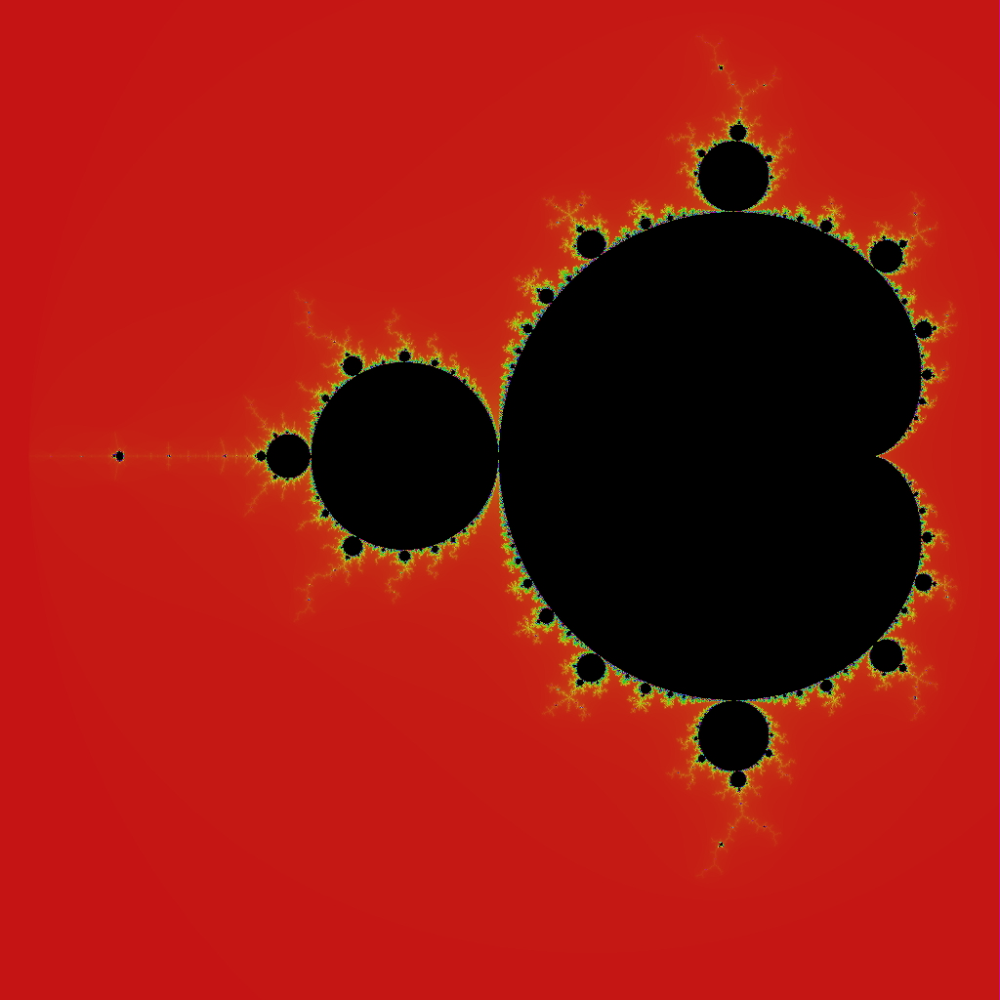
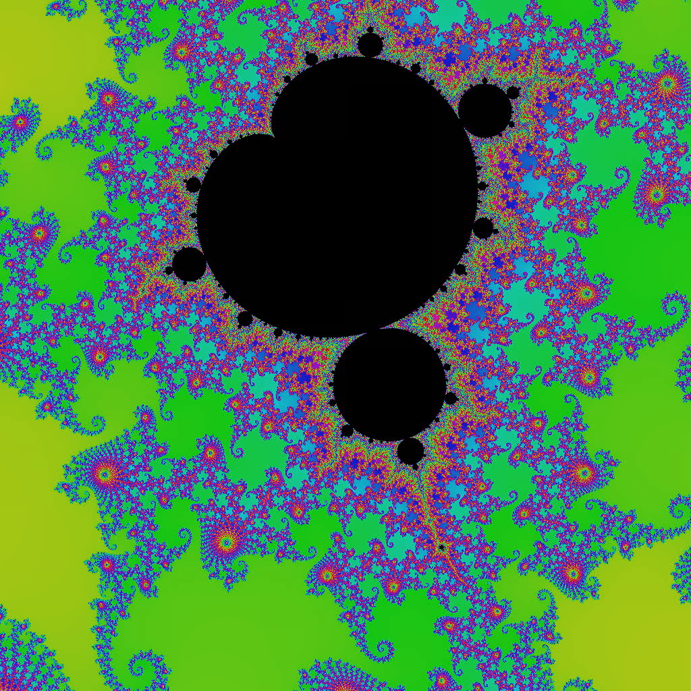
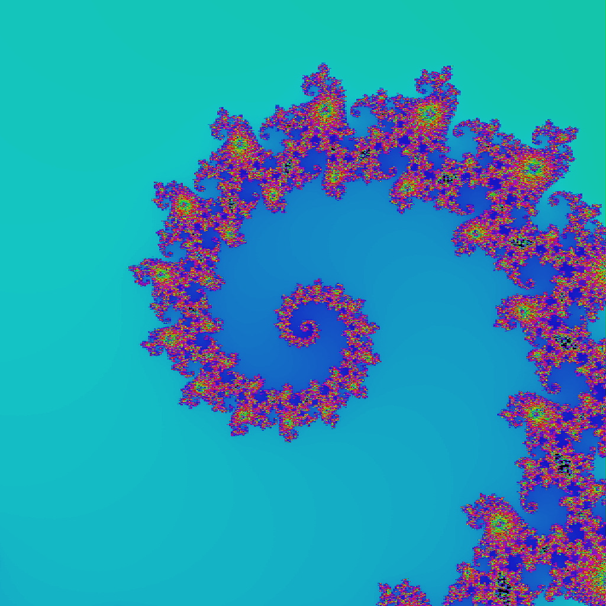
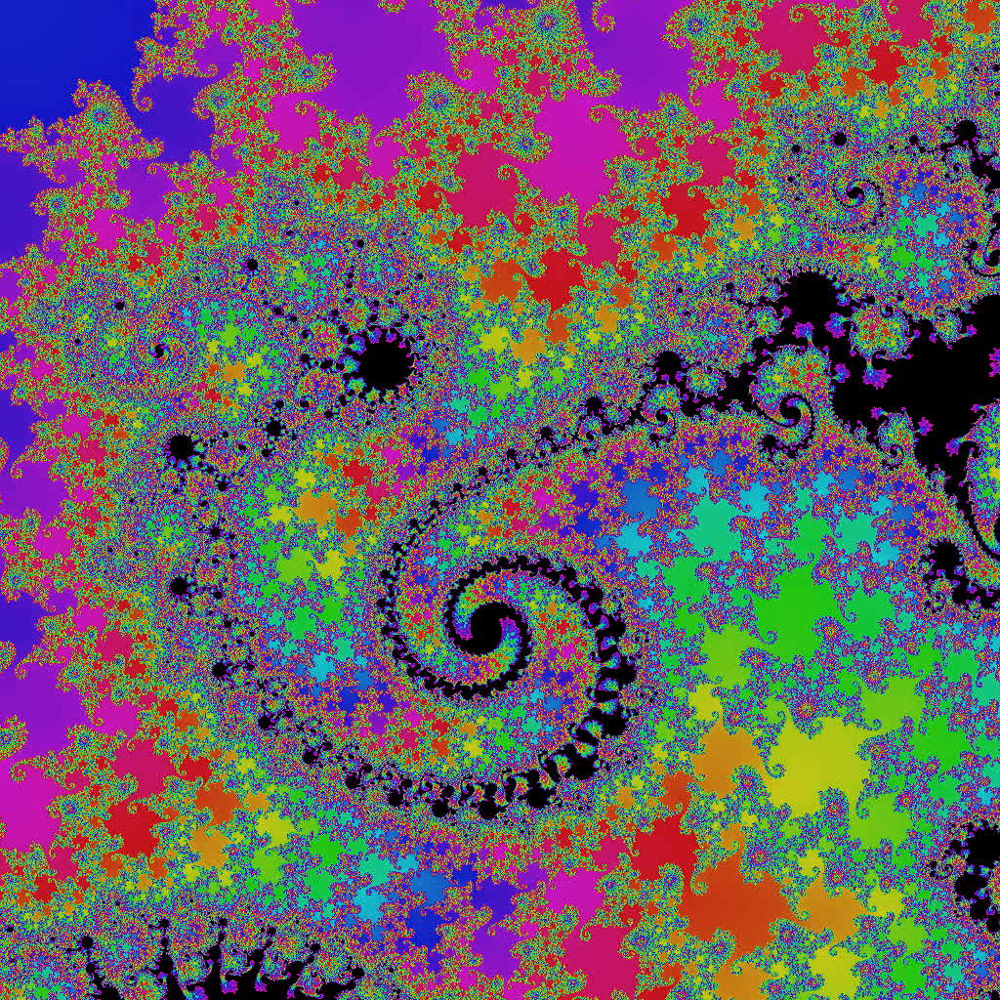

# Mandelbrot Set Visualizer

This repository contains a C++ program and supporting files for visualizing the Mandelbrot set. The Mandelbrot set is a famous fractal that is known for its intricate and beautiful boundary structures that exhibit an infinite level of recursive detail.

## Structure

The repository includes the following files:
- `complex_numbers.cpp` and `complex_numbers.h`: Define a class for complex number arithmetic.
- `color.cpp` and `color.h`: Provided by my professor Prof. Dr. Selgrad, these define a function for mapping iteration counts to colors.
- `mandelbrot.cpp`: Contains the main program that generates images of the Mandelbrot set.
- `zoom.sh`: A shell script partially provided by the professor to generate a zooming video of the Mandelbrot set.
- `kardioid.png`, `antenna_of_satellite.png`, `seahorse_tail.png`, `spirale.png`: Example images from different parts of the Mandelbrot set.
- `mandelbrot.mov`: A 30-second video showcasing a zoom into the Mandelbrot set at a resolution of 1024x1024 pixels.
- `Makefile`: to compile the program easy.


## Compiling the Program

To compile the Mandelbrot set visualizer, ensure you have a C++ compiler that supports C++17 and the `png++` library installed on your system. The program also utilizes OpenMP for parallel computing to speed up the image generation process.

The included `Makefile` simplifies the compilation process. To compile the program, simply run the following command in the terminal from the root directory of this repository:

```sh
make
```

This command will compile the source files and create an executable named `prog` (or another name if specified differently in your `Makefile`). Ensure that the `Makefile` is correctly set up to include all necessary source files and linked libraries.


## Generating Images

After compiling the program, you can generate an image by running:

```sh
./mandelbrot 1024 1024 output.png
```

Replace `1024 1024` with your desired width and height, and `output.png` with your desired output file name.

## Generating a Zoom Video

The `zoom.sh` script can be used to generate a zooming video of the Mandelbrot set:

```sh
./zoom.sh
```

You can adjust the zooming parameters within `zoom.sh` to control the center point, zoom rate, and image size. The script uses `ffmpeg` to stitch together individual frames into a video.

## Example Images and Video

The repository includes four example images and a video:

  
*Shows the main cardioid of the Mandelbrot set.*

  
*Depicts the structure of an antenna-like protrusion from the set.*

  
*Illustrates the spiral formations known as seahorse tails.*

  
*Features a spiral pattern within the fractal.*

To view the 30-second journey into the complexity of the Mandelbrot set at high resolution, download and play the video file: [Mandelbrot Video](mandelbrot.mov).


## Acknowledgements

The `color.cpp` and `color.h` files were provided by my professor Prof. Dr. Selgrad, along with portions of the `zoom.sh` shell script. They play a crucial role in the visualization process by mapping the iteration counts to a color spectrum that enhances the details of the fractal.

## Contributing

Contributions to the project are welcome, whether they involve refining the algorithms, enhancing the visualization, or improving the performance.

## License

This project is open source and available under the [MIT License](LICENSE).

